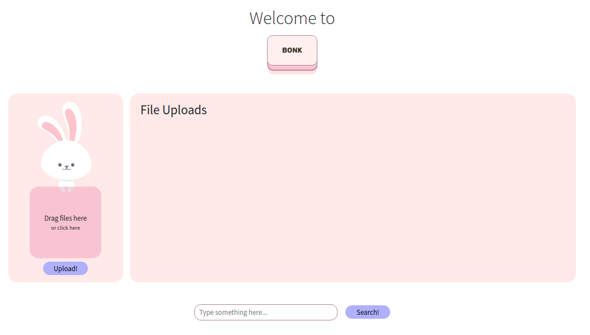
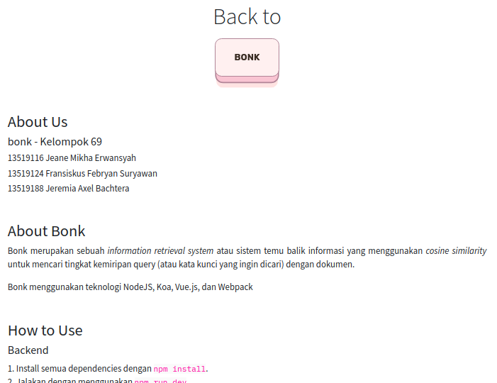

# Tugas Besar Aljabar Linier dan Geometri 02
> Information Retrieval menggunakan cosine similarity
## Daftar Isi
* [Anggota](#anggota)
* [Teknologi](#teknologi-yang-digunakan)
* [Cara Menjalankan](#cara-menjalankan)
* [Tampilan](#tampilan)

## Anggota
| Nama | NIM |
|---|---|
| Jeane Mikha Erwansyah | 13519116 |
| Fransiskus Febryan Suryawan | 13519124 |
| Jeremia Axel Bachtera | 13519188 |

## Teknologi yang digunakan
- NodeJS
- Koa
- Vue.js
- Webpack

## Cara Menjalankan
### Search Engine
1. Install semua dependencies dengan `npm install`
2. Jalankan dengan menggunakan `npm run start` atau `npm run dev`
3. Buka [localhost port 6969](http://localhost:6969) di browser
4. Profit
### Scraper
1. Install semua dependencies dengan 'npm install'
2. Jalankan dengan menggunakan `npm run scrape`
3. ???
4. Profit

## Tampilan

* Halaman About dapat diakses melalui tombol "BONK".
